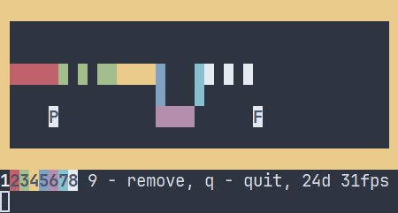

# Online Paint
Online Paint is a simple cross-platform console-based online drawing application that allows multiple users to draw on a shared canvas in real-time using a UDP-based client-server architecture.



## Features
- Console-based real-time drawing
- Multiple users support
- UDP-based communication

## Instalation
### Release
You can download the latest release [here](https://github.com/Pawelgit1234/online_paint/releases/tag/Release).

### Build from Source
Requirements:
- C++17 or newer
- CMake 3.15+
- Boost 1.87+ (including Boost.Asio and Boost.Log)
- A compatible compiler (GCC, Clang, or MSVC)

```bash
# Clone the repository
git clone https://github.com/Pawelgit1234/online_paint.git
cd online_paint

# Create and navigate to the build directory
mkdir build && cd build

# Run CMake to generate build files
cmake ..

# Build the project on linux
make

# Build the project on windows
cmake --build . --config Release
```

## Usage
### Running the Server
```bash
./online_paint_server -p <port>
```
### Running the Client
```bash
./online_paint_client
```

## Controls
- Arrorws — Move cursor
- 1 - 8 — Draw a dot
- 9 — Remove a dot
- q — Quit from server

## Contributing
Contributions are welcome! Feel free to submit issues or pull requests.

## License
This project is licensed under the MIT License. See [LICENSE](https://github.com/Pawelgit1234/online_paint/blob/main/LICENSE.txt) for details.